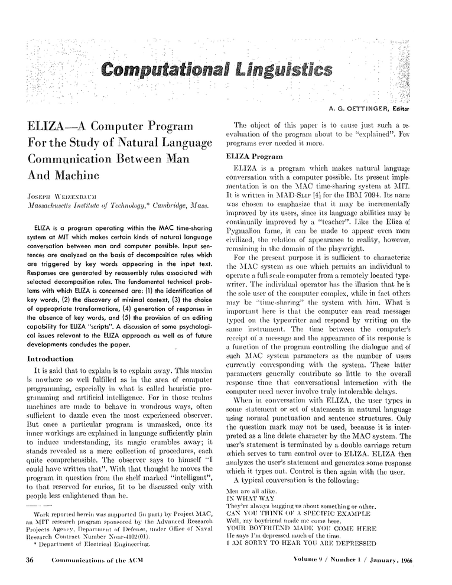
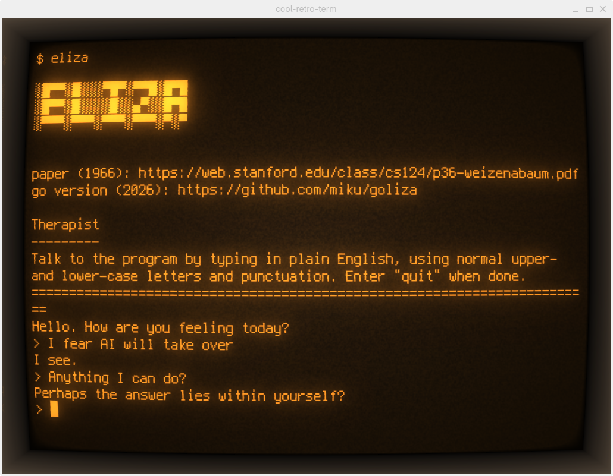

# goliza

A clean, simple Go implementation of the ELIZA chatbot from 1966, by
[Weizenbaum](https://web.stanford.edu/class/cs124/p36-weizenabaum.pdf).

[](https://web.stanford.edu/class/cs124/p36-weizenabaum.pdf)

## About

ELIZA, created by [Joseph
Weizenbaum](https://de.wikipedia.org/wiki/Joseph_Weizenbaum) at MIT in the
early 1960s, is widely considered the world's first chatbot. The original was
written in MAD-SLIP on MIT's CTSS (Compatible Time-Sharing System), the world's
first time-sharing system.

This implementation attempts to port the classic ELIZA DOCTOR script to Go,
maintaining the pattern-matching approach and response structure.



## Features

- Pattern-based natural language processing using regular expressions
- Reflection mechanism (converts "I am" → "you are", etc.)
- Random response selection for variety
- Classic DOCTOR script personality (Rogerian therapist)
- Single-file implementation for simplicity

## Install

```bash
$ go install github.com/miku/goliza@latest # will install "goliza" binary
```

## Building

```bash
$ make
```

## Running

```bash
./goliza
```

Example conversation:

```
Therapist
---------
Talk to the program by typing in plain English, using normal upper-
and lower-case letters and punctuation. Enter "quit" when done.
========================================================================
Hello. How are you feeling today?
> Hello
Hello... I'm glad you could drop by today.
> I am feeling sad
Did you come to me because you are feeling sad?
> My mother never understood me
Tell me more about your mother.
> quit
Thank you for talking with me.
```

## References

- Original paper: [ELIZA—a computer program for the study of natural language communication between man and machine](https://web.stanford.edu/class/cs124/p36-weizenabaum.pdf)
- Recent restoration: [ELIZA Reanimated: The world's first chatbot restored](notes/ELIZA_Reanimated_The_worlds_first_chatbot_restore.txt)
- A python example implementation: [misc/main.py](misc/main.py)
